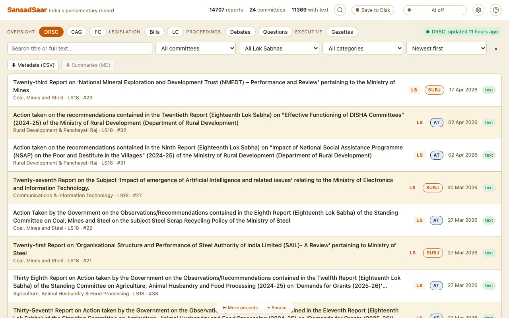

# SansadSaar

> Browse, search, and summarise reports from India's 24 Parliamentary Standing Committees — privately, in your browser.

**[Live →](https://sansadsaar.naklitechie.com)** · **[User guide →](https://sansadsaar.naklitechie.com/guide/)**

No accounts. No keys required. No data leaves your device.



## What it does

- **Browse** every report from all 24 Departmentally Related Standing Committees (DRSCs) — 16 chaired by Lok Sabha, 8 by Rajya Sabha. **14,700+ reports** across LS14–18.
- **Search** — title + full-text across every PDF the mirror has extracted. Categories auto-tagged (Demand for Grants, Action Taken, Bills, Assurances, Subjects).
- **AI summary** — one click → plain-English 4-section briefing of any report. Cached locally.
- **Ask** — chat with a report. Your question + the report text + your cached summary (when one exists) go to the AI of your choice. Per-report Q&A history persists across sessions.
- **Web search enrichment** (optional) — let Tavily / Brave / SearXNG feed recent web context into Ask.
- **Export** — filtered metadata as CSV, generated summaries as Markdown.

## Why

DRSCs are the institutional mechanism through which Indian Parliament actually scrutinises the executive. Their reports — on demands for grants, bills, and policy subjects — are evidence-based and non-partisan. They're also poorly indexed and rarely read. SansadSaar fixes the discovery layer; AI fixes the skim layer; both happen on your machine.

## Privacy model

| What | Where it lives | Leaves the browser? |
|------|----------------|---------------------|
| API keys (if set) | `localStorage` | Only to the provider you picked |
| Generated AI summaries | IndexedDB (`summaries`) | No |
| Per-report chat threads | IndexedDB (`chats`) | No |
| Extracted PDF text | IndexedDB (`texts`) | No |
| Model weights | Cache Storage | One-time download from Hugging Face |
| Static report data | IndexedDB (`blobs`) | One-time fetch from GitHub Pages mirror |

No analytics, no accounts, no telemetry, no SansadSaar server (we don't have one). The page is a static `index.html`.

## AI options

Two modes, picked in **Settings**:

**Local AI** (default, free, no key) — runs entirely on your GPU via [Transformers.js](https://huggingface.co/docs/transformers.js) + WebGPU. Five models supported:

| Model | Download | Notes |
|-------|---------:|-------|
| Gemma 4 E2B | ~1.5 GB | Default. Good balance. |
| Gemma 4 E4B | ~4.9 GB | Stronger summaries. |
| Ternary Bonsai 1.7B | ~470 MB | Smallest. Quick first-run. |
| Ternary Bonsai 4B | ~1.1 GB | Sweet spot. |
| Ternary Bonsai 8B | ~2.2 GB | 64K context. |

**BYOK** — plug in your own key for Anthropic, OpenAI, Gemini, Groq, OpenRouter, Ollama, or any OpenAI-compatible endpoint. **Free tiers**: Gemini (15 RPM, 1M tokens/day), Groq (~30 RPM, fast), OpenRouter (`:free` models), Ollama (fully local). Costs of paid tiers documented in the [user guide](https://sansadsaar.naklitechie.com/guide/#costs).

## Architecture

| Layer        | Where it lives                                                                 |
| ------------ | ------------------------------------------------------------------------------ |
| Data scrape  | [`NakliTechie/parliamentwatch-data`](https://github.com/NakliTechie/parliamentwatch-data) — daily GH Action runs Pranay Kotasthane's [Python scraper](https://github.com/pranaykotas/parliamentwatch) and commits the output. |
| Data hosting | GitHub Pages serves `reports.json` + `text/<committee>/LS<n>_<num>.txt` with proper CORS. |
| App          | This repo — one `index.html`, no build step, served from GitHub Pages with Cloudflare in front for the custom domain. |
| AI inference | Transformers.js v4 on WebGPU, or any OpenAI-/Anthropic-compatible API. |

The two-repo split exists because `sansad.in` blocks cross-origin browser fetches. The mirror does the scraping server-side and re-publishes as static files; the browser app stays purely a presentation layer.

## Credit

Built on top of [**ParliamentWatch**](https://github.com/pranaykotas/parliamentwatch) by **Pranay Kotasthane**. The scraping logic, committee API map, and the original idea are his — SansadSaar repackages it as a single HTML file with on-device AI. Full credit list in the in-app Help → Credits tab.

## Local dev

```bash
python3 -m http.server 8000
```

Pass `?data=URL` to override the data mirror (e.g. `?data=/parliamentwatch-data/docs/` against a sibling local checkout of the mirror repo).

## License

MIT — see [LICENSE](LICENSE).

---

Part of the [NakliTechie](https://naklitechie.github.io/) browser-native series.
